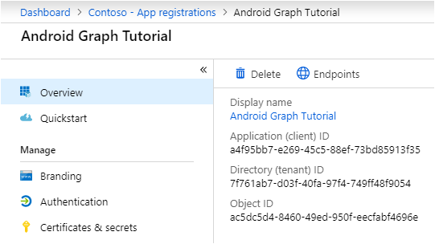

# Выполнение завершенного проектаHow to run the completed project

## Необходимые условияPrerequisites

Чтобы запустить завершенный проект в этой папке, вам потребуются следующие компоненты:To run the completed project in this folder, you need the following:

- [Android Studio](https://developer.android.com/studio/) , установленный на компьютере для разработки.[Android Studio](https://developer.android.com/studio/) installed on your development machine. (**Примечание:** данное руководство было написано при использовании Android Studio версии 3.3.1 с 1.8.0 JRE и пакетом SDK для Android 9,0.(**Note:** This tutorial was written with Android Studio version 3.3.1 with the 1.8.0 JRE and the Android 9.0 SDK. Действия, описанные в этом руководстве, могут работать с другими версиями, но не тестировались.The steps in this guide may work with other versions, but that has not been tested.)
- Личная учетная запись Майкрософт с почтовым ящиком на Outlook.com или рабочей или учебной учетной записью Майкрософт.Either a personal Microsoft account with a mailbox on Outlook.com, or a Microsoft work or school account.

Если у вас нет учетной записи Майкрософт, у вас есть несколько вариантов для получения бесплатной учетной записи:If you don't have a Microsoft account, there are a couple of options to get a free account:

- Вы можете [зарегистрироваться для создания новой личной учетной записи Майкрософт](https://signup.live.com/signup?wa=wsignin1.0&rpsnv=12&ct=1454618383&rver=6.4.6456.0&wp=MBI_SSL_SHARED&wreply=https://mail.live.com/default.aspx&id=64855&cbcxt=mai&bk=1454618383&uiflavor=web&uaid=b213a65b4fdc484382b6622b3ecaa547&mkt=E-US&lc=1033&lic=1).You can [sign up for a new personal Microsoft account](https://signup.live.com/signup?wa=wsignin1.0&rpsnv=12&ct=1454618383&rver=6.4.6456.0&wp=MBI_SSL_SHARED&wreply=https://mail.live.com/default.aspx&id=64855&cbcxt=mai&bk=1454618383&uiflavor=web&uaid=b213a65b4fdc484382b6622b3ecaa547&mkt=E-US&lc=1033&lic=1).
- Вы можете [зарегистрироваться в программе для разработчиков office 365](https://developer.microsoft.com/office/dev-program) , чтобы получить бесплатную подписку на Office 365.You can [sign up for the Office 365 Developer Program](https://developer.microsoft.com/office/dev-program) to get a free Office 365 subscription.

## Регистрация приложения на портале AzureRegister an application with the Azure Portal

1. Откройте браузер и перейдите в [Центр администрирования Azure Active Directory](https://aad.portal.azure.com) и войдите с помощью **личной учетной записи** (т.е. учетной записи Майкрософт) или **рабочей или учебной учетной записи**.Open a browser and navigate to the [Azure Active Directory admin center](https://aad.portal.azure.com) and login using a **personal account** (aka: Microsoft Account) or **Work or School Account**.

1. Выберите **Azure Active Directory** в левой панели навигации, а затем выберите **Регистрация приложений** в разделе **Управление**.Select **Azure Active Directory** in the left-hand navigation, then select **App registrations** under **Manage**.

    

1. Выберите **Новая регистрация**.Select **New registration**. На странице**Зарегистрировать приложение** задайте необходимые значения следующим образом.On the **Register an application** page, set the values as follows.

    - Введите **имя** `Android Graph Tutorial`.Set **Name** to `Android Graph Tutorial`.
    - Введите **поддерживаемые типы учетных записей** для **учетных записей в любом каталоге организаций и личных учетных записей Microsoft**.Set **Supported account types** to **Accounts in any organizational directory and personal Microsoft accounts**.
    - Оставьте поле **URI перенаправления** пустым.Leave **Redirect URI** empty.

    

1. Выберите **регистр**.Select **Register**. На странице **учебника Xamarin Graph** СКОПИРУЙТЕ значение **идентификатора Application (Client)** и сохраните его, он понадобится на следующем шаге.On the **Xamarin Graph Tutorial** page, copy the value of the **Application (client) ID** and save it, you will need it in the next step.

    

1. Выберите ссылку **Добавить URI перенаправления** .Select the **Add a Redirect URI** link. На странице " **Перенаправление URI** " выберите раздел **Перенаправление URI для общедоступных клиентов (мобильный, Настольный)** .On the **Redirect URIs** page, locate the **Suggested Redirect URIs for public clients (mobile, desktop)** section. Выберите URI, который начинается с `msal` и скопируйте его, а затем нажмите кнопку **сохранить**.Select the URI that begins with `msal` and copy it, then select **Save**. Сохраните скопированный URI перенаправления, он понадобится вам на следующем шаге.Save the copied redirect URI, you will need it in the next step.

    

## Запуск приложенияRun the sample

В Android Studio выберите пункт **запустить приложение "** в меню" **выполнить** ".In Android Studio, select **Run 'app'** on the **Run** menu.
